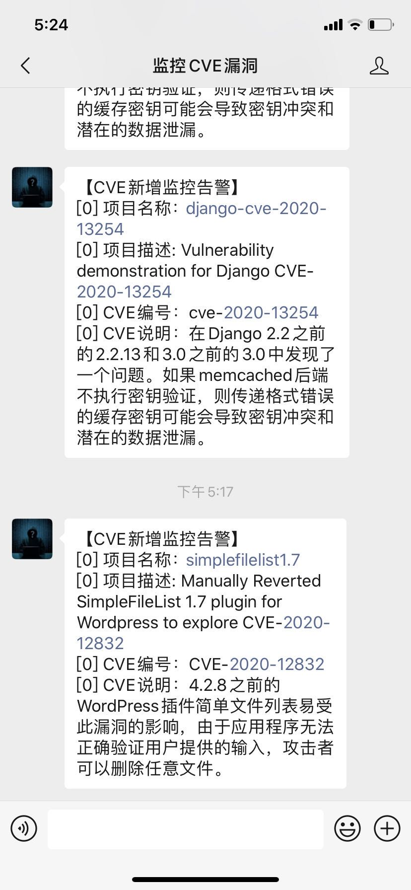

# ScanCVE 0.1

这个脚本主要定时扫描github，监控cve的增量情况，如存在增量poc情况，则会通过微信公众号进行告警。

## 作者 ##

咚咚呛 

如有其他建议，可联系微信280495355

## 技术细节 ##
技术细节如下

	1、定时通过github的api搜索关键字
	2、增量监控cve特征
	3、提取cve编号，进行mitre查询，并翻译为汉语说明
	4、动态配置需要推送的微信公众号CORPID、CORPSECRET等

## 程序使用 ##

> root# <kbd>git clone https://github.com/grayddq/ScanCVE.git</kbd>
>
> root# <kbd>cd ScanCVE</kbd>
>
> root# <kbd>sudo pip install -r requirements.txt</kbd>
>
> root# <kbd>vim conf/info.conf</kbd>  #配置微信公众号信息
>
> root# <kbd>nohup python ScanCVE.py &</kbd>

## 运行截图 ##

